## INTRODUCTION
Cool Friends App uses Spring Boot. It includes features based on consumption of REST APIs. The features are:  
1.  Like on user profiles by registered user.
2. Comment on user profiles by registered user.
3. Search Function for list of users.
4.  Inbox for registered users to view their likes and comments.

Implementation of REST APIs allows different HTTP methods `GET`, `PUT`, `POST` and `DELETE` by other application to perform retrieval and actions on the data.  

## USE FEATURES

### Like On User Profiles
Registered users can view another user’s profile. Like function is added to encourage user’s interaction. A Like button click on a user’s profile tells the liked user he or she is liked by notifying him or her in Inbox. Naturally, user’s profile which has more likes is likelier to be more popular. The following figure shows a profile page with the Like button.  

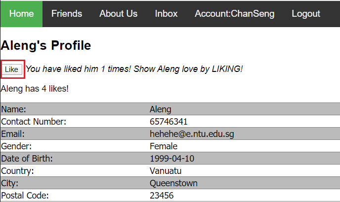  
In above figure, the user *Aleng*’s Profile has been liked 4 times and each time the Like button is clicked, *Aleng*’s number of likes will increase by one.

### Comment On User Profiles
Another feature to encourage user’s interaction is Comment in user’s profile. All the comments of a user is displayed on his or her profile. Each time someone comments on the user’s profile, the commented user receives a notification in his or her Inbox. The following figure displays the comment input box as well as the list of comments a user receives.  

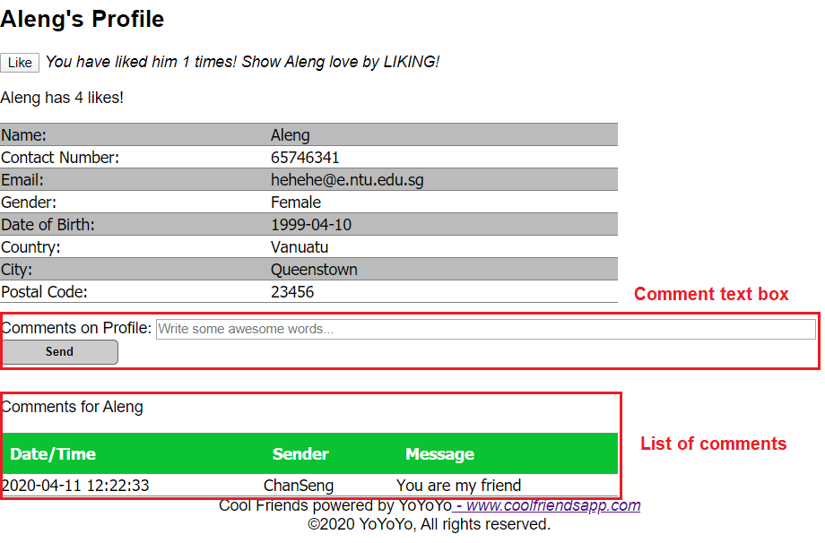  
From above figure, user can comment on *Aleng*’s profile by entering some messages on the comment text box followed by clicking Send button. The figure also displays the list of comments *Aleng* receives.

### Search Function In Friends List
As the number of registered users increases, for better user experience, a search function is required to help users in finding the other users they are interested in. Registered users can search for other users based on name, gender, country or city. The following figures show a search for users having *leng* in their names and the search results.  

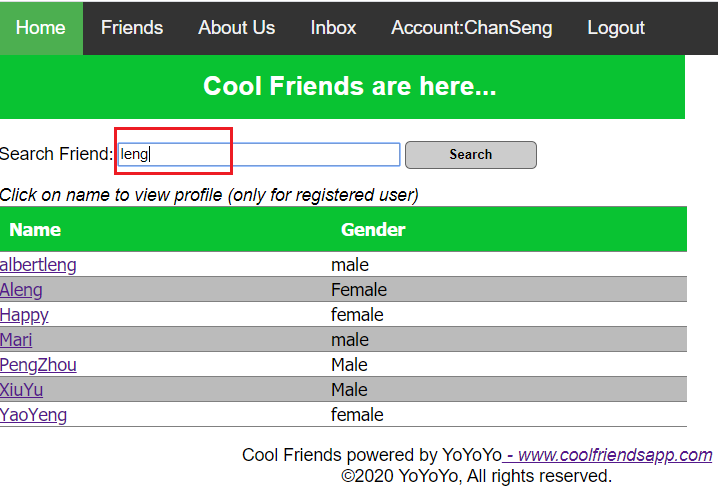  

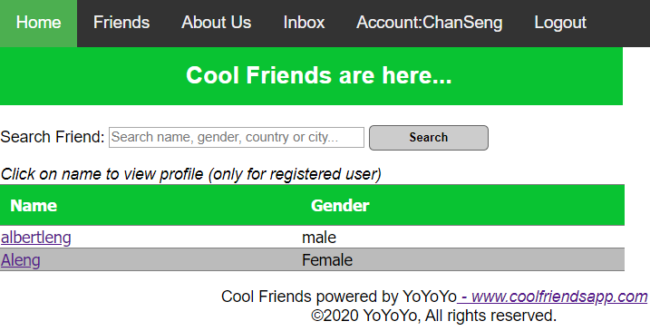  

### Inbox Function For Registered Users
Registered users can view the likes and comments they receive in Inbox as shown in figure below.  

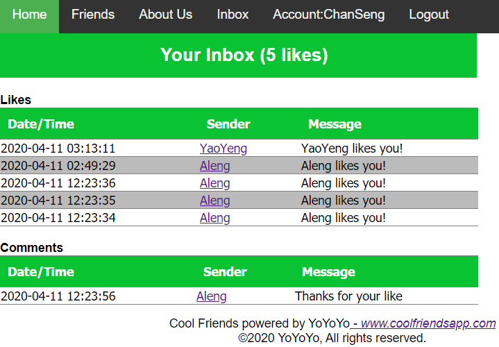  

## Technical Design
### Summary of Technology Stack
`Spring Initializr` was used to generate the starter files and the dependencies were added without having to concern about which versions to use. Below is the list of technologies used:
1. Java 1.8 - Java runtime which supports the Spring MVC Web app framework in this app.
2. Maven – Build and dependency tool for the project.
3. Spring Boot 2.2.6.
4. Spring Data JPA.
5. Spring Web.
6. Spring Boot DevTools.
7. Java Servlet Page (JSP) for views.
8. JavaServer Pages Standard Tag Library (JSTL) for defining JSP tags that encapsulate core functionality common to JSP applications. 
9. MySQL Version 8.0.18.
10. Eclipse IDE for Enterprise Java Developers, Version: 2019-12 (4.14.0).  

### Project Structure
The project contains the following main parts:
1. Java Packages with classes:  
 a. Application  
 b. Controller  
 c. DAO  
 d. Entity  
 e. Rest Controller  
 f. Rest Service  
 g. Service  
2. Resources folder which contain images and application.properties.
3. Webapp templates which contain jsp views.
4. Pom.xml.  

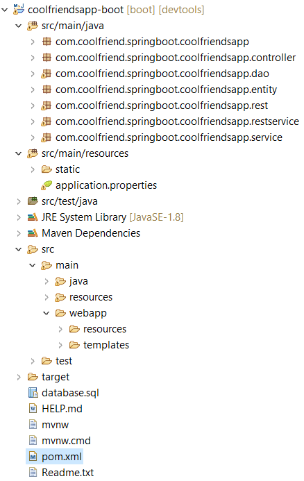  

### Spring Boot Flow Architecture
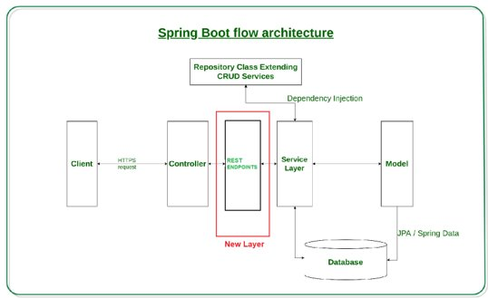  
Benefits of a new layer between controller and service layer, i.e. implementation of `RestTemplate` in calls to REST APIs:  
1. No more tedious and error prone XML configurations.
2. Easy creation and maintenance of REST Endpoints.
3. Easy Dependency Management.
4. Embedded Tomcat Server.
5. Microservice Based Architecture.  

### REST API Endpoints
Below are list of API Endpoints based on the entities in the project, i.e. User, Comment, Like and LoginoutHistory. The URLs to access the REST APIs are listed in application.properties under resources folder. These URLs are used by REST Controllers and the REST Service Implementations.  

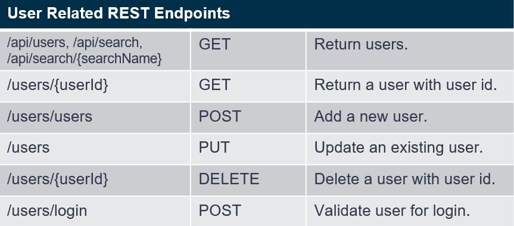  
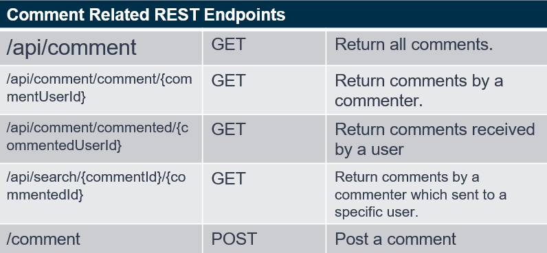  
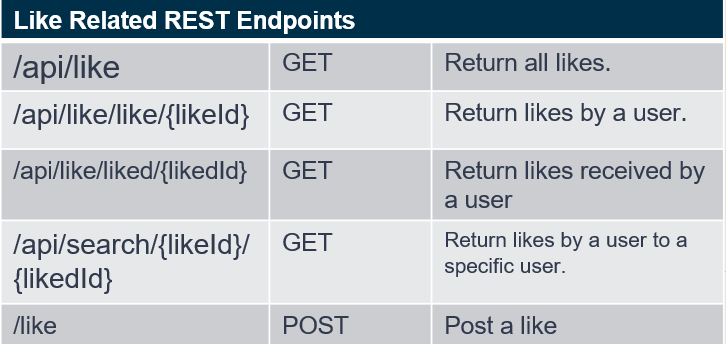  
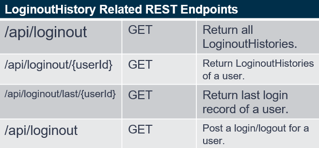  

The REST endpoints were tested using POSTMAN and below is a sample output to retrieve a user of user id 1.  

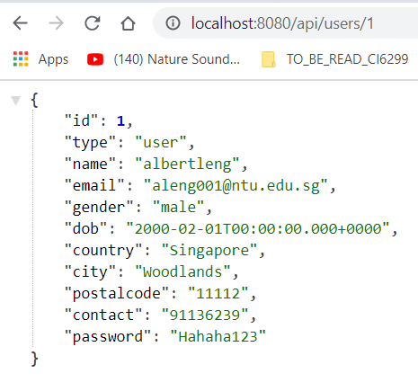  

Exception handling is also added to return to the client meaningful messages which include status, error message and timestamp. The exception handling is written in `RestErrorResponse.java`, `RestExceptionHandler.java` and `RestNotFoundException.java` in `com.coolfriends.springboot.coolfriendsapp.rest` package. The figure below shows the response if an invalid user id is used to call the user REST API.  

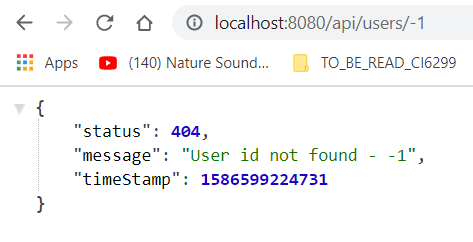  

### Leveraging Cool Friends App REST API For Data
The following figure gives  a simplified architecture of this project. It encapsulates the DAO and service layers from the client.  
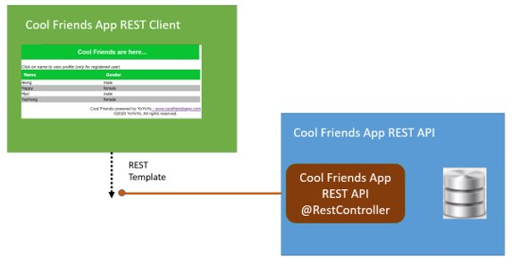  

The following figure displays the detailed architecture of how Cool Friends App REST Client leverages Cool Friends App REST API for data.  
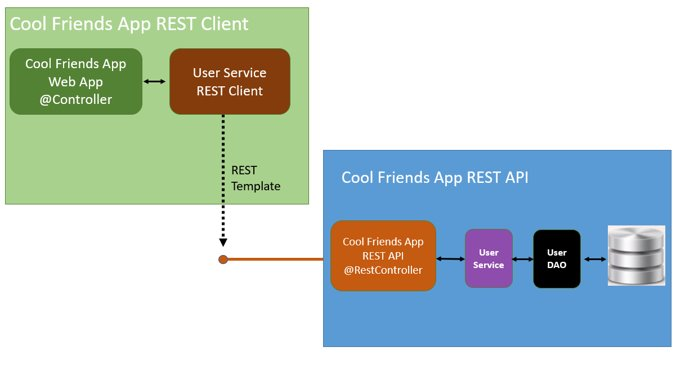  

Cool Friends App REST Client has a new User Rest Service implementation which uses REST Template to consume data from Cool Friends App REST API. For the client, there is no need to handle backend data access to the database. All database interactions are handled by the backend Cool Friends App REST API. Figure above is applicable to other entities in this project as well namely `Comment`, `Like` and `LoginoutHistory`.  

### ER and CLASS DIAGRAM
Figure below is the ER diagram of the database tables involved.  
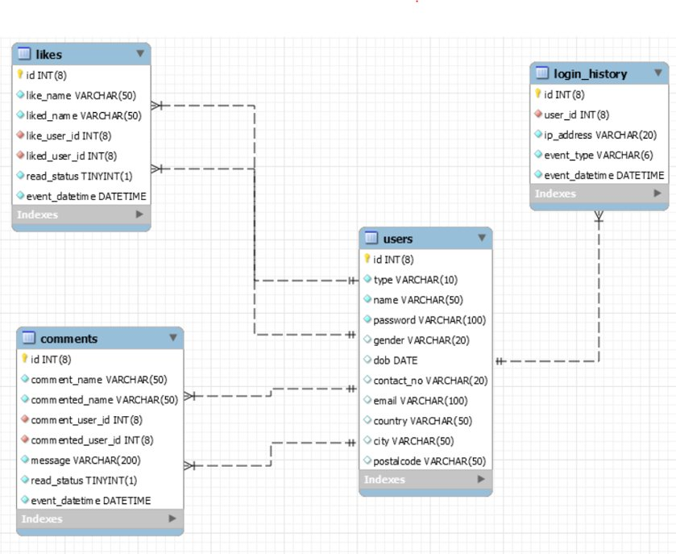  

The following figure shows the Class Diagram of this project. From the Class Diagram, the controllers are mainly associated with the Rest Service interfaces due to its leveraging of REST APIs for data.  
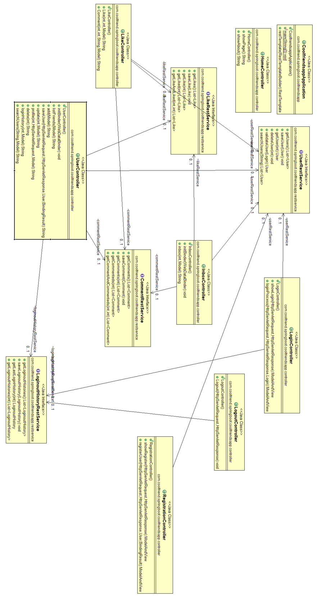  

### DATABASE DUMP
The sql script to create database and tables in MySQL is included in [here](database.sql).  

### FUTURE WORKS
    1. Using Angular as the web application framework.
    2. Using Thymeleaf as the server-side Java template engine.
    3. Adding Spring Security to secure REST API Endpoints and Cool Friends App.
    4. Improving the look and feel of Cool Friends App.

### REFERENCES
[Spring Web MVC](https://docs.spring.io/spring/docs/current/spring-framework-reference/web.html)  
[The Spring Framework - Reference Documentation](https://docs.spring.io/spring-framework/docs/2.0.x/reference/index.html)

